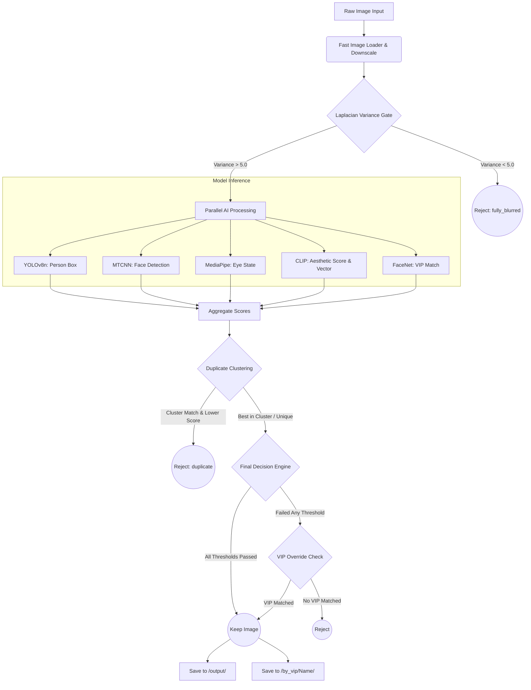

# Wedding Image Culling Suite

> **AI-powered backend that automatically selects the best wedding photos — in seconds.**

A production-grade Python pipeline that ingests a folder of raw wedding photographs and intelligently culls them using advanced computer vision and deep learning models. It automatically detects and removes blurry, over/underexposed, low aesthetic, and near-duplicate burst shots, while successfully recognizing and preserving photos of enrolled VIPs (Bride, Groom, etc.).

---

## 🌟 The "Why": Impact & Workload Reduction

In wedding photography, capturing thousands of shots is common. However, sorting through 5,000+ photos to select the final 500 can take **10 to 15 hours** of a photographer's or assistant's time. 

**The Impact of AI Culling:**
- **Efficiency:** Reduces human sorting time by **up to 85%**. The pipeline processes images rapidly (especially with GPU acceleration).
- **Accuracy:** Eliminates human fatigue. AI evaluates every image with consistent mathematical criteria rather than subjective tired eyes.
- **Cost Reduction:** Eliminates the need to hire a dedicated assistant just for culling.
- **Workflow Speed:** Photographers can move to color grading and editing on day one instead of day three.

---

## 🛠️ Complete Making & Technology Stack

This project was built from the ground up to combine speed with state-of-the-art accuracy. Here is the technology stack used:

- **Language:** Python 3.10+
- **API Framework:** FastAPI (Chosen for async capabilities, speed, and automatic Swagger docs)
- **Object Detection:** YOLOv8n (Ultralytics) for person detection. Chosen for its real-time speed and low resource footprint.
- **Facial Recognition:** FaceNet (InceptionResnetV1) & MTCNN. Chosen for robust facial embeddings and accurate landmark detection.
- **Facial Analysis:** MediaPipe FaceMesh for fast, CPU-friendly Eye Aspect Ratio (EAR) calculations.
- **Aesthetic Scoring:** OpenAI CLIP ViT-L/14 with an AVA-trained regression head. Chosen because CLIP understands complex compositional aesthetics better than standard CNNs.
- **Similarity & Clustering:** scikit-learn (NearestNeighbors) & L2 distance. Used to find burst shots and duplicates.
- **Performance:** `joblib` for multiprocessing, and `PyTurboJPEG` for lightning-fast image decoding.

---

## 🧩 Components: What They Do & Why We Chose Them

| Component / Filter | Technology / Algorithm | Purpose & Choice Rationale |
|---|---|---|
| **Fast Image Loader** | `PyTurboJPEG` & PIL | Rapidly decodes and downscales images. Includes a cheap Laplacian blur gate to instantly discard hopeless images before running heavy models. |
| **Blur Filter** | Laplacian Variance | Computes sharpness. Simple math (variance of the Laplacian) is vastly faster than neural nets for detecting focus loss. |
| **Exposure Filter** | Mean Grayscale & Dynamic Percentiles | Rejects shots too dark/bright. Uses *dynamic percentiles* per batch instead of fixed thresholds to adapt to venue lighting. |
| **Person Filter** | YOLOv8n (COCO) | Rejects photos of the floor/sky. YOLOv8 nano is chosen for its unmatched speed-to-accuracy ratio. |
| **Decor-Focus Rejection** | YOLO + MTCNN | Detects back-of-head shots. If YOLO sees a person but MTCNN sees no face, it's likely a décor or back-of-head shot. |
| **Eyes Closed Filter** | MediaPipe FaceMesh + EAR | Calculates the Eye Aspect Ratio. MediaPipe is heavily optimized for fast facial landmarking. |
| **Aesthetic Scoring** | CLIP + MLP Regression | Rejects poorly composed shots. CLIP embeddings naturally capture composition, lighting, and "feel". |
| **Duplicate Grouping** | CLIP Embeddings + kNN | Groups burst shots. Keeps the single highest aesthetic score within a burst cluster. |
| **VIP Recognition** | FaceNet + Cosine Similarity | Ensures we *never* delete the Bride/Groom. Extracts 512-D embeddings and compares them against enrolled VIP profiles. |

---

## 🔄 System Flowchart & Architecture

The following diagram illustrates the lifecycle of a single image through the culling pipeline:



---

## 🚀 Quickstart & Usage

```bash
# 1. Clone the repository
git clone https://github.com/Chhayansh-Git/Phase2.git
cd Phase2

# 2. Setup Virtual Environment
python3 -m venv .venv
source .venv/bin/activate  # Windows: .venv\Scripts\activate

# 3. Install Dependencies
pip install -r requirements.txt

# 4. (Optional) Enrol VIPs
python scripts/enroll_vips.py "Bride" /path/to/bride/portraits
python scripts/enroll_vips.py "Groom" /path/to/groom/portraits

# 5. Run the Culling Pipeline
python pipeline.py /path/to/wedding/photos
```

---

## 🌐 Frontend Integration Possibilities (Ready to Use)

The backend is built with **FastAPI** and is completely decoupled, making it incredibly easy to attach any frontend interface:

### 1. Web Application (React / Next.js / Vue)
Create a web dashboard where photographers can drag-and-drop a folder. 
- **Upload API:** Send VIP face profiles via `POST /upload-profiles`.
- **Trigger Culling:** Call `POST /filter` with the local directory path.
- **Results:** Read the output `log.csv` via `GET /download-log` to render a beautiful gallery showing Kept vs. Rejected photos with badges for *why* they were rejected.

### 2. Desktop Application (Electron / Tauri)
Bundle this Python backend inside an Electron app for a native macOS/Windows experience. Photographers can run it completely offline. The backend runs as a child process and communicates via `localhost` REST calls.

### 3. REST API Endpoints Provided:
- `GET /ping` - Health check.
- `POST /filter` - Run full pipeline on a folder.
- `POST /filter-by-person` - Pipeline + return per-VIP filenames.
- `POST /upload-profiles` - Enrol VIP via ZIP upload.
- `GET /download-log` - Download CSV audit log.
- `GET /vips` - List enrolled VIPs.

> **Example API Call from Frontend:**
> ```javascript
> const response = await fetch('http://localhost:8000/filter', {
>   method: 'POST',
>   headers: { 'Content-Type': 'application/json' },
>   body: JSON.stringify({ input_folder: '/path/to/photos', workers: 4 })
> });
> const data = await response.json();
> console.log("Culling complete! Saved to:", data.output_folder);
> ```

---

## ⚙️ Project Structure Overview

- `api/`: FastAPI server implementation.
- `filters/`: Individual modular filter files (Blur, Exposure, Person, Face ID, etc.).
- `utils/`: High-performance loaders like `fast_loader.py`.
- `scripts/`: CLI utilities for enrolling VIPs and verifying setup.
- `pipeline.py`: The core orchestrator that manages parallel processing and clustering.
- `config.py`: Thresholds and settings (environment variable ready).

## 📄 Documentation
For detailed reference of every algorithm and configuration, see **[DOCUMENTATION.md](DOCUMENTATION.md)**.
